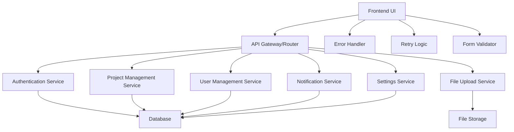
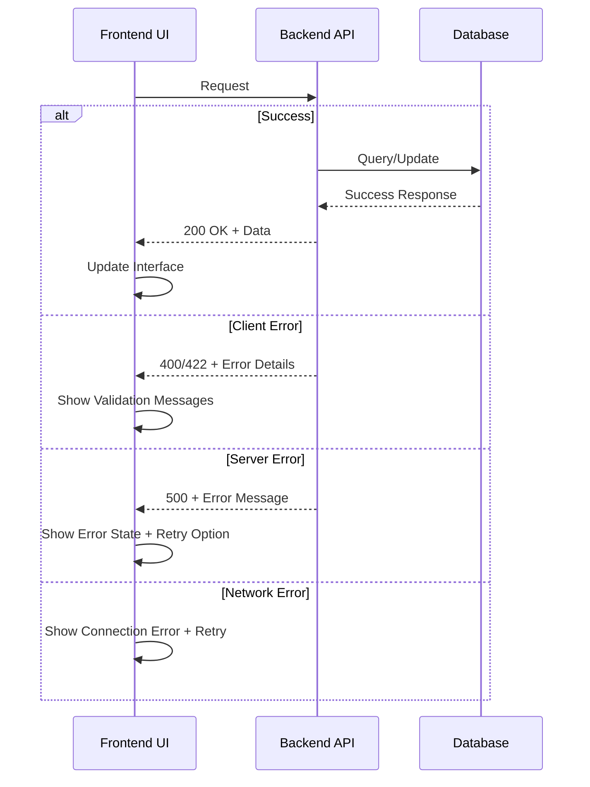

# Design Document

## Overview

This design addresses the critical system stabilization needs identified through comprehensive testing. The solution focuses on establishing robust API endpoints, implementing proper error handling, fixing authentication flows, and ensuring reliable CRUD operations across the admin dashboard. The design prioritizes immediate stability while laying groundwork for long-term maintainability.

## Architecture

### System Components



### Error Handling Flow



## Components and Interfaces

### 1. API Endpoint Stabilization

**Core API Routes Structure:**
```
/api/v1/
├── auth/
│   ├── POST /login
│   ├── POST /logout
│   └── GET /verify
├── projects/
│   ├── GET /
│   ├── POST /
│   ├── PUT /:id
│   └── DELETE /:id
├── users/
│   ├── GET /
│   ├── PUT /:id/role
│   └── PUT /:id/status
├── notifications/
│   ├── GET /
│   ├── POST /
│   └── PUT /:id/read
├── uploads/
│   └── POST /files
└── settings/
    ├── GET /
    └── PUT /
```

**Request/Response Standards:**
- All endpoints return consistent JSON structure
- Error responses include `error`, `message`, and `details` fields
- Success responses include `success`, `data`, and optional `message` fields
- HTTP status codes follow REST conventions

### 2. Authentication System Redesign

**Login Flow:**
```typescript
interface LoginRequest {
  email: string;
  password: string;
}

interface LoginResponse {
  success: boolean;
  data?: {
    user: User;
    token: string;
    expiresAt: string;
  };
  error?: string;
  message?: string;
}
```

**Session Management:**
- JWT tokens with proper expiration
- Automatic token refresh mechanism
- Secure session storage
- Logout cleanup

### 3. CRUD Operations Framework

**Standardized CRUD Interface:**
```typescript
interface CRUDService<T> {
  create(data: Partial<T>): Promise<ApiResponse<T>>;
  read(id?: string): Promise<ApiResponse<T | T[]>>;
  update(id: string, data: Partial<T>): Promise<ApiResponse<T>>;
  delete(id: string): Promise<ApiResponse<void>>;
}
```

**Project Management:**
- Form validation before submission
- Optimistic UI updates with rollback capability
- Real-time status feedback
- Bulk operations support

### 4. User Management Interface

**User Operations:**
```typescript
interface UserManagement {
  updateRole(userId: string, role: UserRole): Promise<ApiResponse<User>>;
  toggleStatus(userId: string, active: boolean): Promise<ApiResponse<User>>;
  getAuditTrail(userId: string): Promise<ApiResponse<AuditEntry[]>>;
}
```

**UI Components:**
- Selectable user list with proper event handling
- Role dropdown with immediate feedback
- Status toggle with confirmation dialogs
- Audit trail display (if available)

### 5. File Upload System

**Upload Architecture:**
```typescript
interface FileUploadService {
  uploadFile(file: File, options: UploadOptions): Promise<UploadResult>;
  validateFile(file: File): ValidationResult;
  getUploadProgress(): Observable<ProgressEvent>;
}

interface UploadOptions {
  maxSize: number;
  allowedTypes: string[];
  generateThumbnail: boolean;
}
```

**Features:**
- Drag-and-drop interface
- Progress indicators
- File type validation
- Size limit enforcement
- Image preview generation
- Error handling with retry options

### 6. Notification System

**Notification Management:**
```typescript
interface NotificationService {
  getNotifications(): Promise<ApiResponse<Notification[]>>;
  createNotification(data: NotificationData): Promise<ApiResponse<Notification>>;
  markAsRead(id: string): Promise<ApiResponse<void>>;
  deleteNotification(id: string): Promise<ApiResponse<void>>;
}
```

**Real-time Updates:**
- WebSocket connection for live notifications
- Badge count synchronization
- Auto-refresh mechanism
- Offline queue for failed operations

## Data Models

### Core Entities

```typescript
interface User {
  id: string;
  email: string;
  role: 'admin' | 'user' | 'moderator';
  active: boolean;
  createdAt: string;
  updatedAt: string;
}

interface Project {
  id: string;
  title: string;
  description: string;
  category: string;
  imageUrl?: string;
  demoUrl?: string;
  githubUrl?: string;
  downloadUrl?: string;
  techStack: string[];
  featured: boolean;
  status: 'active' | 'inactive' | 'draft';
  createdAt: string;
  updatedAt: string;
}

interface Notification {
  id: string;
  title: string;
  message: string;
  type: 'info' | 'warning' | 'error' | 'success';
  status: 'read' | 'unread';
  createdAt: string;
  userId?: string;
}

interface SystemSettings {
  id: string;
  key: string;
  value: string;
  type: 'string' | 'number' | 'boolean' | 'json';
  description?: string;
  updatedAt: string;
}
```

### API Response Wrapper

```typescript
interface ApiResponse<T> {
  success: boolean;
  data?: T;
  error?: string;
  message?: string;
  details?: Record<string, any>;
  timestamp: string;
}
```

## Error Handling

### Frontend Error Management

**Error Types:**
1. **Network Errors**: Connection failures, timeouts
2. **Authentication Errors**: Invalid credentials, expired sessions
3. **Validation Errors**: Form field validation, data format issues
4. **Server Errors**: Internal server errors, database failures
5. **Business Logic Errors**: Constraint violations, permission issues

**Error Handling Strategy:**
```typescript
class ErrorHandler {
  handleApiError(error: ApiError): void {
    switch (error.type) {
      case 'network':
        this.showRetryDialog(error);
        break;
      case 'validation':
        this.showFieldErrors(error.details);
        break;
      case 'authentication':
        this.redirectToLogin();
        break;
      case 'server':
        this.showErrorToast(error.message);
        break;
      default:
        this.showGenericError();
    }
  }
}
```

### Backend Error Responses

**Standardized Error Format:**
```json
{
  "success": false,
  "error": "VALIDATION_ERROR",
  "message": "Invalid input data",
  "details": {
    "field": "email",
    "code": "INVALID_FORMAT",
    "description": "Email format is invalid"
  },
  "timestamp": "2025-11-02T10:30:00Z"
}
```

### Retry Logic

**Retry Strategy:**
- Exponential backoff for network failures
- Maximum 3 retry attempts
- User-initiated retry for critical operations
- Queue failed operations for later retry
- Preserve user context during retries

## Testing Strategy

### Unit Testing
- API endpoint testing with mock data
- Form validation testing
- Error handling scenario testing
- Authentication flow testing

### Integration Testing
- End-to-end CRUD operations
- File upload workflows
- Authentication and authorization flows
- Error recovery scenarios

### User Acceptance Testing
- Admin dashboard functionality
- Mobile responsiveness
- Cross-browser compatibility
- Performance under load

### Automated Testing
- API health checks
- Frontend smoke tests
- Database integrity tests
- Security vulnerability scans

## Implementation Phases

### Phase 1: Critical API Fixes
- Fix 404 endpoint errors
- Implement proper error responses
- Add request validation
- Set up basic authentication

### Phase 2: Frontend Stabilization
- Fix form submission issues
- Implement error handling
- Add retry mechanisms
- Improve user feedback

### Phase 3: CRUD Operations
- Complete project management
- Fix user management interface
- Implement file uploads
- Add notification system

### Phase 4: System Hardening
- Add comprehensive testing
- Implement monitoring
- Optimize performance
- Security enhancements

## Security Considerations

- Input validation and sanitization
- SQL injection prevention
- XSS protection
- CSRF token implementation
- Rate limiting on API endpoints
- Secure file upload validation
- Authentication token security
- Session management best practices

## Performance Optimization

- Database query optimization
- Frontend bundle optimization
- Image compression and lazy loading
- API response caching
- Connection pooling
- CDN integration for static assets